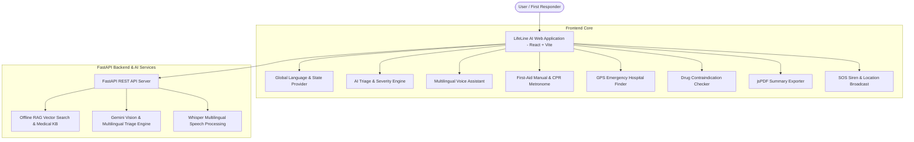

# LifeLine AI – Offline Emergency Medical Assistant 🚑💡

[](https://life-line-ai-offline-emergency-assi.vercel.app/)
[](https://github.com/shivapoloju/LifeLine-AI-Offline-Emergency-Assistant)
[](https://react.dev)
[](https://fastapi.tiangolo.com)

**LifeLine AI** is a disaster-resilient, offline-first HealthTech and Emergency Response application designed for rural villages, low-connectivity regions, and crisis situations. It provides real-time AI symptom triage, multi-lingual voice interactions (English, Hindi, Telugu), step-by-step first-aid protocols, Gemini visual injury assessment, GPS hospital locating, drug interaction safety warnings, and instant emergency PDF report generation — functioning seamlessly even without internet access.

👉 **Live Production App**: **[https://life-line-ai-offline-emergency-assi.vercel.app/](https://life-line-ai-offline-emergency-assi.vercel.app/)**

---

## 🌟 Key Features & End-to-End Functionality

### 1. 🩺 Symptom-Based AI Triage & Severity Prediction
- **Urgency Ratings**: Evaluates symptoms into 4 severity levels: `CRITICAL`, `HIGH`, `MEDIUM`, and `LOW`.
- **Immediate Guidance**: Generates localized emergency instructions, action steps, and urgency warnings.
- **Voice Audio Playback**: Read out first-aid steps in native speech accents.

### 2. 🎙️ Multilingual Voice Assistant
- **Hands-Free Voice Triage**: Supports speech-to-text input and voice audio synthesis in **English**, **Hindi (हिंदी)**, and **Telugu (తెలుగు)** using Speech Recognition and Whisper AI integration.

### 3. 📖 Offline Medical Knowledge Base (RAG Engine)
- **Local Medical Dataset**: Embedded RAG vector index containing first-aid protocols for Cardiac Arrest, Snakebites, Severe Burns, Heatstroke, Fractures, Poisoning, and Choking.
- **CPR Metronome**: Interactive audio-visual rhythm counter (100–120 BPM) guiding chest compression speed during cardiac emergencies.

### 4. 📷 Visual Injury Assessment (Gemini Vision)
- **Image Scanner**: Allows paramedics or victims to upload or capture photos of wounds, burns, or bites for AI visual evaluation, tissue redness analysis, and recommended sterile dressings.

### 5. 📍 GPS Nearby Hospital & Emergency Locator
- **Trauma Center Search**: Automatically detects user GPS coordinates to display nearby emergency hospitals.
- **Critical Capability Badges**: Shows availability of **Anti-Snake Venom (ASV)**, **ICU Beds**, **Oxygen Supply**, and distance in kilometers with one-tap phone dialing.

### 6. 💊 Medicine Safety & Drug Contraindication Warnings
- **Medicines NOT to Take**: Highlights dangerous medication errors (e.g. Aspirin/Ibuprofen in Dengue fever causing internal bleeding, or NSAIDs in severe dehydration).
- **Scheduled Dose Reminders**: Offline medication scheduler with dose timing and browser notifications.

### 7. 🚨 High-Decibel SOS Siren & GPS Location Broadcast
- **Audio Siren Synthesizer**: Plays an emergency alarm sound using Web Audio API synthesis to alert nearby individuals in disaster zones.
- **Location Broadcast**: Generates instant WhatsApp and SMS alert links with exact Google Maps coordinates.

### 8. 📄 Emergency Medical PDF Summary Export
- **Instant Admission Summary**: Generates a downloadable PDF report formatted with patient vitals (BP, Pulse, SpO2, Age), symptoms, triage severity rating, and executed first-aid steps for paramedics and ER doctors.

---

## 🏗️ Architecture & System Workflow



---

## 🛠️ Tech Stack

### **Frontend**
- **Core Framework**: React 18 + Vite
- **Routing**: React Router DOM v6
- **Styling**: Modern Custom CSS Glassmorphism Design System (Vibrant Blue & White Theme)
- **Icons**: Lucide React
- **Document Generation**: jsPDF
- **Speech Engine**: Web Speech API (SpeechRecognition & SpeechSynthesis)
- **Maps & Geolocation**: Leaflet / Geolocation API

### **Backend**
- **Server**: Python FastAPI + Uvicorn
- **AI & Vision Model**: Google Gemini 1.5 Flash SDK
- **Vector Retrieval**: FAISS Vector Store + RAG Engine
- **Audio Processing**: Whisper AI Audio Service
- **Data Format**: Structured JSON Medical Knowledge Base

---

## 📦 System Requirements & Setup Guide

### Prerequisites
- **Node.js**: `v18.x` or higher
- **Python**: `3.10` or higher
- **Git**

---

### 💻 Installation Steps

#### 1. Clone the Repository
```bash
git clone https://github.com/shivapoloju/LifeLine-AI-Offline-Emergency-Assistant.git
cd LifeLine-AI-Offline-Emergency-Assistant
```

#### 2. Setup & Start Backend Server
```bash
cd backend
pip install -r requirements.txt
python -m uvicorn app.main:app --reload --port 8000
```
*The FastAPI server will start on `http://localhost:8000` (API documentation available at `http://localhost:8000/docs`).*

#### 3. Setup & Start Frontend Application
Open a new terminal window:
```bash
cd frontend
npm install
npm run dev
```
*The React web application will launch at `http://localhost:3000`.*

---

## 🌐 Dual Execution Mode (Online vs Offline RAG)

- **Online Mode**: Uses FastAPI backend endpoints for deep Gemini 1.5 Vision analysis and real-time AI triage.
- **Offline RAG Mode**: When disconnected from the internet during disaster situations, the application automatically switches to local vector search, browser IndexedDB cache, and Speech API so emergency triage never fails.

---

## 🛡️ License & Safety Disclaimer

**Disclaimer**: *LifeLine AI is designed as a disaster assistance tool and first-responder triage support system. In life-threatening emergencies, always contact official national emergency medical services (108 / 112) immediately.*
